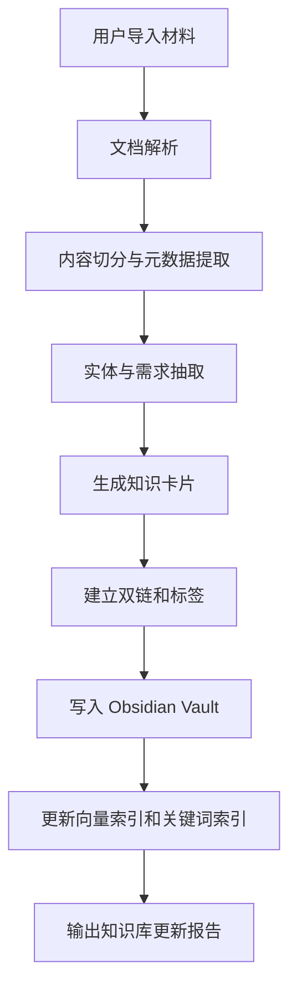
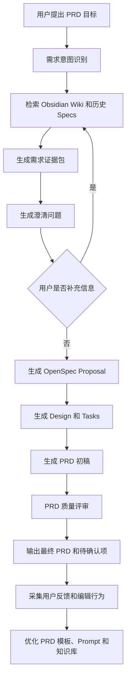
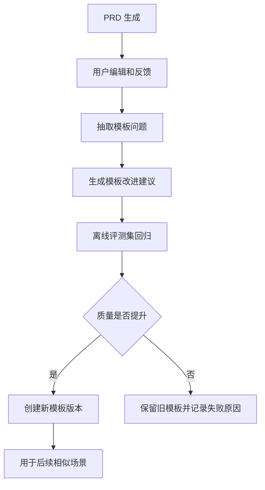

# BA Agent 技术方案设计：Obsidian + LLM Wiki + OpenSpec SDD

## 1. 设计目标

本项目希望建设一个面向 Business Analyst 和 Product Manager 的 BA Agent 系统，核心能力包括：

- 构建面向产品、客户、业务、竞品和利益相关方的可演化知识库。
- 基于知识库和用户输入生成结构化 PRD。
- 使用 OpenSpec / SDD 思路管理需求规格、变更、设计和任务。
- 将 BA 工作拆解为两个协作 Agent：
  - 知识库构建 Agent。
  - SDD 规范 PRD 生成 Agent。

整体思路不是做一个“聊天生成 PRD”的玩具，而是建设一个能沉淀组织知识、持续复用上下文、可追溯地产出需求文档的 BA 工作系统。

## 2. 核心技术思路

### 2.1 Obsidian + LLM Wiki

Obsidian 适合作为本地优先、Markdown 原生、双链友好的知识库底座。它的优势是：

- 所有知识以 Markdown 文件保存，便于 Git 管理和 Agent 读写。
- 支持双链、标签、目录、frontmatter，适合构建产品知识图谱。
- 知识可以同时给人读、给 LLM 检索、给 Agent 改写。
- 适合从“个人/团队知识库”逐步升级为“产品智能体记忆系统”。

### 2.2 Obsidian CLI 自动化

除了把 Obsidian Vault 当作普通 Markdown 文件夹读写，还可以引入 Obsidian CLI 作为知识库工程化入口。

Obsidian CLI 的价值不在于替代 Obsidian App，而是让 Agent 可以通过命令行方式稳定执行一组知识库操作：

- 初始化或检查 Vault 目录结构。
- 创建标准化 Markdown 笔记。
- 根据模板生成客户、干系人、功能、流程、风险、决策等卡片。
- 检查双链、反向链接、孤立笔记和缺失引用。
- 管理或检查 Obsidian 配置文件。
- 执行批量重命名、移动、归档、标签修复。
- 触发知识库索引更新。

推荐把 Obsidian CLI 放在知识库构建 Agent 的工具层，而不是直接让 LLM 任意写文件。

```text
LLM 决策层
  判断要创建什么知识、更新什么卡片、建立什么关系。

Agent 工具层
  调用 Obsidian CLI 或本地文件工具执行受控操作。

Vault 文件层
  保存 Markdown、frontmatter、双链、模板和附件。
```

这样可以把“知识库写入”从自由文本生成变成受约束的工程动作，减少文件名混乱、目录漂移、frontmatter 不一致和重复笔记。

> 注意：具体使用哪个 Obsidian CLI 实现，需要在开发阶段确认。方案层先定义 CLI 适配层，后续可以接入社区 Obsidian CLI、自己封装的 `vault` 命令，或基于 Node/Python 的本地脚本。

### 2.3 Obsidian CLI 适配层设计

建议不要让业务 Agent 直接依赖某个 CLI 的命令细节，而是设计一个 `VaultTool` 适配层。

```text
Knowledge Builder Agent
  -> VaultTool.create_note()
  -> VaultTool.update_note()
  -> VaultTool.find_backlinks()
  -> VaultTool.check_missing_links()
  -> VaultTool.apply_template()
  -> VaultTool.reindex()

VaultTool
  -> Obsidian CLI
  -> Markdown filesystem
  -> Search / vector index
```

推荐工具接口：

| 工具方法 | 说明 |
|---|---|
| `init_vault(path)` | 初始化或检查 Vault 基础目录。 |
| `create_note(type, title, content, metadata)` | 基于卡片类型创建标准笔记。 |
| `update_note(path, patch)` | 更新已有笔记内容。 |
| `apply_template(type, variables)` | 使用模板生成笔记骨架。 |
| `list_notes(filter)` | 按类型、标签、状态、产品域查询笔记。 |
| `find_related(title)` | 查找双链、反链和语义相关笔记。 |
| `check_links()` | 检查缺失链接、孤立笔记和重复别名。 |
| `move_note(path, target)` | 移动或归档笔记。 |
| `reindex()` | 更新关键词索引、向量索引和元数据表。 |

LLM Wiki 的设计重点不是简单做向量库，而是让知识具有结构、来源、关系和生命周期。

推荐采用四层知识结构：

```text
原始材料层 Raw Notes
  存放客户访谈、会议纪要、产品 Wiki、竞品资料、工单、反馈、历史 PRD 等原始输入。

结构化知识层 Structured Wiki
  将原始材料整理成客户、角色、业务流程、功能、痛点、约束、决策等标准知识卡片。

最佳实践层 Best Practices
  存放业界 PRD 优秀实践、模板、案例、写作规范、评审 checklist 和优秀表达方式。

规格资产层 Spec Assets
  存放 PRD、BRD、用户故事、验收标准、OpenSpec change、design、tasks 等可交付资产。
```

进一步拆分后，Wiki 中至少应包含三类长期知识：

| 知识类型 | 内容 | 在 PRD 生成中的作用 |
|---|---|---|
| 业务知识 | 客户、产品、业务流程、角色、规则、约束、风险、决策 | 保证 PRD 写的是正确业务事实。 |
| 业界 PRD 优秀实践 | 公开模板、优秀案例、行业写作结构、评审标准 | 提供 PRD 结构、表达方式和完整性 checklist。 |
| 团队历史 PRD | 公司内部已经评审或上线的 PRD、BRD、用户故事、验收标准 | 学习团队自己的写作风格、字段习惯、颗粒度和交付标准。 |

这三类知识不能混用：

- 业务知识回答“这个需求事实是什么”。
- 业界实践回答“这个 PRD 应该怎么组织才专业”。
- 团队历史 PRD 回答“我们团队通常怎么写、怎么评审、怎么落地”。

### 2.4 OpenSpec / SDD 思路

OpenSpec 的核心思想是通过规格驱动开发，把需求变更、设计说明、任务拆解和最终规格放入仓库管理。

在本项目中，我们可以把它改造成“产品需求 SDD”：

- `project.md`：描述产品背景、业务上下文、标准和约束。
- `specs/`：存放已经确认的稳定能力规格。
- `changes/`：存放新增需求、变更需求、需求评审和任务拆解。
- `design.md`：描述业务方案、流程、数据、权限、交互和技术影响。
- `tasks.md`：拆解需求澄清、设计、开发、测试、上线和复盘任务。

这样 PRD 不再只是一个孤立文档，而是一个从知识库证据、需求变更、规格设计到任务落地的完整链路。

## 3. 双 Agent 分工

## 3.1 知识库构建 Agent

### 目标

知识库构建 Agent 负责读取用户提供的材料，并将其沉淀为 Obsidian/LLM Wiki 中可复用、可检索、可追溯的结构化知识。

### 输入

- 产品设计文档。
- 业务 Wiki。
- 客户访谈记录。
- 会议纪要。
- 客服工单和用户反馈。
- 竞品分析。
- 数据分析报告。
- 研发接口或技术约束说明。
- 现有 PRD/BRD/用户故事。
- 业界 PRD 优秀实践模板和案例。
- 团队历史 PRD、BRD、评审记录和上线复盘。

### 输出

- 标准化 Markdown 知识卡片。
- 文档摘要和标签。
- 客户需求卡片。
- 干系人卡片。
- 功能能力卡片。
- 业务流程卡片。
- 约束与风险卡片。
- 决策记录。
- 可检索索引元数据。
- 业界 PRD 实践卡片。
- 团队历史 PRD 模式卡片。
- PRD 写作风格和评审标准卡片。

### 主要能力

| 能力 | 说明 |
|---|---|
| 文档解析 | 支持 Markdown、PDF、Word、网页、会议纪要等输入。 |
| 信息抽取 | 抽取客户、角色、功能、痛点、目标、约束、风险、指标。 |
| 知识归类 | 将内容归入客户、产品、流程、功能、竞品、决策等分类。 |
| 双链构建 | 自动生成 Obsidian 链接，例如 `[[客户A]]`、`[[支付流程]]`。 |
| 来源追踪 | 保留来源文件、段落、时间、作者、可信度。 |
| 冲突检测 | 识别不同材料之间的矛盾和待确认点。 |
| 知识更新 | 新材料进入后更新已有卡片，而不是重复生成孤立文档。 |
| 实践抽象 | 从业界 PRD 和历史 PRD 中抽取结构、字段、表达方式、验收标准模式。 |
| 风格学习 | 总结团队历史 PRD 的常用章节、颗粒度、命名、评审偏好。 |

### 推荐知识卡片格式

```markdown
---
type: customer_need
source: "客户访谈-2026-06-01.md"
status: draft
confidence: medium
owner: BA
tags:
  - customer-need
  - payment
  - enterprise
---

# 客户需要：批量审批付款

## 背景

客户财务团队每周需要处理大量付款申请，当前审批依赖人工邮件确认。

## 真实诉求

- 降低重复审批成本。
- 保证审批链路可审计。
- 支持不同金额区间的权限控制。

## 相关角色

- [[财务经理]]
- [[审批人]]
- [[出纳]]
- [[企业管理员]]

## 证据

- 来源：客户访谈 2026-06-01。
- 原始表达：客户提到“每周付款审批太多，邮件里经常漏”。

## 待确认问题

- 金额阈值如何配置？
- 是否需要多级审批？
- 是否需要和 ERP 对接？
```

## 3.2 SDD 规范 PRD 生成 Agent

### 目标

SDD 规范 PRD 生成 Agent 负责基于知识库、用户目标和 OpenSpec 风格规格流程，生成完整、可追溯、可评审、可落地的 PRD。

### 输入

- 用户提出的需求目标。
- 知识库构建 Agent 生成的结构化卡片。
- 业务知识检索结果。
- 业界 PRD 最佳实践检索结果。
- 团队历史 PRD 检索结果。
- 相关历史 PRD。
- OpenSpec 现有 `specs/` 和 `changes/`。
- 用户选择的 PRD 模板。
- 业务约束、上线时间、团队资源。

### 输出

- PRD 文档。
- OpenSpec change proposal。
- design.md。
- tasks.md。
- delta spec。
- 用户故事。
- 验收标准。
- 待澄清问题。
- 风险与依赖清单。
- 干系人评审材料。

### 主要能力

| 能力 | 说明 |
|---|---|
| 需求理解 | 识别用户想解决的问题和期望产出。 |
| 知识检索 | 从 Obsidian Wiki 和向量库中检索相关证据。 |
| 分层检索 | 区分业务事实、业界实践、团队历史 PRD，避免把写法参考误当成业务事实。 |
| 需求拆解 | 拆分背景、目标、范围、用户故事、流程、功能、数据、权限。 |
| SDD 生成 | 按 OpenSpec 风格生成 proposal、design、tasks 和 spec delta。 |
| PRD 生成 | 生成完整 PRD，包含来源、假设和待确认问题。 |
| 质量评审 | 检查模糊需求、缺失验收标准、冲突、不可开发内容。 |
| 版本归档 | 需求确认后将 change archive 到稳定 specs。 |

### 三路检索策略

SDD PRD 生成 Agent 写 PRD 前，应同时进行三路检索：

| 检索通道 | 检索对象 | 输出 | 使用边界 |
|---|---|---|---|
| 业务事实检索 | 客户、产品、流程、规则、风险、决策 | Evidence Pack | 可作为 PRD 事实依据。 |
| 业界实践检索 | 行业模板、优秀案例、review checklist | Template Guidance | 只作为结构和表达参考。 |
| 团队历史检索 | 历史 PRD、BRD、评审评论、上线复盘 | Team Style Pack | 作为团队风格、颗粒度和评审偏好参考。 |

三路结果必须在生成时保持来源标签：

- `fact`：可以进入 PRD 事实描述。
- `practice`：只能进入模板结构、章节建议、写作提示。
- `team_style`：只能影响表达风格、颗粒度和字段习惯。

如果 `practice` 或 `team_style` 与 `fact` 冲突，必须以 `fact` 为准，并输出冲突说明。

## 4. 推荐仓库结构

```text
BA-Agent/
  README.md
  plan.md
  docs/
    ba-agent-technical-design.md
    knowledge-base-schema.md
    prd-sdd-workflow.md
  vault/
    00-inbox/
    10-raw/
    20-wiki/
      customers/
      stakeholders/
      products/
      features/
      processes/
      competitors/
      decisions/
      risks/
      best-practices/
        industry-prd-templates/
        industry-prd-examples/
        prd-review-checklists/
      team-history/
        historical-prds/
        historical-brds/
        review-comments/
        launch-retrospectives/
        writing-patterns/
      feedback/
        template-preferences/
        user-edit-patterns/
        rejected-assumptions/
        accepted-clarifications/
        prd-quality-issues/
    30-spec-assets/
      prds/
      brds/
      user-stories/
      acceptance-criteria/
    90-archive/
  openspec/
    project.md
    specs/
    changes/
      add-feature-x/
        proposal.md
        design.md
        tasks.md
        specs/
  src/
    agents/
      knowledge_builder/
      prd_sdd_generator/
    retrieval/
    parsers/
    schemas/
    workflows/
    evaluators/
  prompts/
    knowledge_builder/
    prd_sdd_generator/
  evals/
    cases/
    rubrics/
```

## 5. Agent 协作流程

### 5.1 知识库构建流程



### 5.2 SDD PRD 生成流程



### 5.3 双 Agent 协作方式

```text
知识库构建 Agent
  负责把材料变成可复用知识。

SDD PRD 生成 Agent
  负责把知识和目标变成可评审需求规格。

共同中间层
  Evidence Pack：需求证据包。
  Clarification Queue：澄清问题队列。
  Requirement Graph：需求、角色、功能、约束之间的关系图。
  Feedback Memory：用户反馈、编辑偏好、模板改进和知识库修正记录。
```

## 6. 自适应反馈与强化学习机制

BA Agent 需要具备自适应反馈机制，让 PRD 生成过程可以通过持续反问、用户反馈、人工编辑和评审结果不断优化。

这里的“强化学习”建议分阶段理解：

- MVP 阶段：做反馈闭环、偏好记录、模板版本优化和评测集回归。
- 进阶阶段：做基于用户反馈的偏好学习、reranking、prompt 自动选择。
- 成熟阶段：在有足够高质量数据和安全评估后，再考虑 RLHF/RLAIF 或任务策略优化。

不要一开始就把核心能力依赖在模型训练上。更稳的做法是先把反馈数据结构化、可追踪、可复盘，形成可训练的数据资产。

### 6.1 反问机制

SDD PRD 生成 Agent 不应该一次性直接生成最终 PRD，而应该在生成前和生成中持续判断信息是否足够。

反问触发条件：

| 触发条件 | 示例 | Agent 行为 |
|---|---|---|
| 业务目标不清晰 | 只说“做一个审批功能” | 询问业务目标、成功指标、目标用户。 |
| 用户角色缺失 | 不知道谁使用、谁审批、谁配置 | 询问主要角色和权限关系。 |
| 范围边界不清晰 | 不知道第一版做什么、不做什么 | 询问 MVP 范围和 out-of-scope。 |
| 规则存在冲突 | 客户想简单审批，法务要求严格审计 | 输出冲突并请求决策。 |
| 验收标准不足 | 只有“页面好用” | 追问可测量的验收条件。 |
| 知识库证据不足 | 没有来源支持关键结论 | 请求补充材料或标记为假设。 |

反问优先级：

1. 阻塞 PRD 正确性的关键问题。
2. 影响研发设计和估算的问题。
3. 影响验收和上线的问题。
4. 可以后续确认的细节问题。

反问输出格式：

```markdown
## 需求澄清问题

### 必须确认

1. 审批金额阈值由谁配置？
2. 是否需要多级审批？
3. 审批通过后是否自动进入付款执行？

### 建议确认

1. 是否需要移动端审批？
2. 是否需要审批超时提醒？

### 可暂时假设

1. 第一版只支持单币种。
2. 第一版只支持企业管理员配置审批规则。
```

### 6.2 反馈信号设计

Agent 需要收集显式反馈和隐式反馈。

显式反馈：

- 用户对 PRD 整体打分。
- 用户标记某段内容有用、无用、错误、缺失。
- 用户选择更喜欢哪个 PRD 模板。
- 用户确认或否定 Agent 的假设。
- 用户回答反问问题。

隐式反馈：

- 用户删除了哪些段落。
- 用户重写了哪些需求。
- 用户保留了哪些用户故事。
- 用户反复让 Agent 重新生成哪些部分。
- 哪些模板在某类需求中被频繁采用。
- 哪些知识卡片经常被引用或被忽略。

推荐反馈数据结构：

```yaml
feedback_id: fb_001
task_id: prd_batch_payment_001
user_id: user_123
target_type: prd_section
target_id: functional_requirements
signal_type: edit
label: incomplete
before: "系统支持审批"
after: "系统应支持按金额阈值配置一级或多级审批流"
reason: "原描述不可开发"
source_context:
  - 客户访谈-2026-06-01.md
  - 审批流程卡片.md
created_at: 2026-06-03
```

### 6.3 Feedback Memory

反馈不应该只存在聊天历史里，而要沉淀成可检索的 `Feedback Memory`。

推荐目录：

```text
vault/
  20-wiki/
    feedback/
      template-preferences/
      user-edit-patterns/
      rejected-assumptions/
      accepted-clarifications/
      prd-quality-issues/
```

反馈记忆类型：

| 类型 | 说明 | 用途 |
|---|---|---|
| 模板偏好 | 某类需求更适合哪种 PRD 结构 | 自动选择 PRD 模板。 |
| 编辑模式 | 用户经常如何改写需求 | 优化生成风格和颗粒度。 |
| 被拒绝假设 | 哪些假设被用户否定 | 避免重复犯错。 |
| 被接受澄清 | 哪些问题回答后显著提升 PRD | 优化反问策略。 |
| 质量问题 | 常见缺陷，如缺验收标准、权限遗漏 | 进入评审 checklist。 |

### 6.4 自动优化 PRD 模板

PRD 模板不应该固定不变。Agent 应根据反馈持续维护模板版本。

模板优化流程：



模板版本建议保存为：

```text
prompts/
  prd_sdd_generator/
    templates/
      enterprise-saas-prd.v1.md
      enterprise-saas-prd.v2.md
      data-report-prd.v1.md
      ai-feature-prd.v1.md
```

每次模板更新必须记录：

- 为什么修改。
- 来自哪些用户反馈。
- 影响哪些 PRD section。
- 在评测集上的效果变化。
- 是否需要人工批准。

### 6.5 自动优化知识库

用户反馈也应该反向更新知识库。

典型场景：

- 用户否定了 Agent 引用的业务规则。
- 用户补充了新的干系人。
- 用户修正了客户真实诉求。
- 用户把 Agent 的假设改成了事实。
- 用户指出某个历史文档已经过期。

知识库更新策略：

| 反馈类型 | 更新动作 |
|---|---|
| 补充事实 | 创建或更新知识卡片，标记来源为用户确认。 |
| 否定假设 | 将原假设移入 rejected assumptions。 |
| 文档过期 | 修改知识卡片状态为 deprecated。 |
| 需求冲突 | 创建 conflict note，并关联相关来源。 |
| 新角色/流程 | 创建 stakeholder/process 卡片并建立双链。 |

关键原则：

- Agent 可以提出知识库更新建议。
- 高置信、低风险内容可以自动写入 draft。
- 影响业务规则、权限、合规、财务的数据必须人工确认后进入 stable。

### 6.6 强化学习落地路径

本项目可以把强化学习拆成三个落地层次。

#### Level 1：规则与反馈闭环

- 记录用户反馈。
- 记录 PRD 修改 diff。
- 根据反馈更新模板 checklist。
- 根据缺失项优化反问问题。

这是 MVP 必须实现的最低版本。

#### Level 2：偏好学习与策略选择

- 根据历史反馈选择更适合的 PRD 模板。
- 根据需求类型选择反问策略。
- 根据用户偏好调整输出颗粒度。
- 使用评测集比较不同 prompt/template 版本。

这个阶段可以先不训练大模型，而是用检索、分类器、reranker 或规则策略完成。

#### Level 3：RLHF / RLAIF

- 收集成对偏好数据，例如用户更喜欢 PRD A 还是 PRD B。
- 构建 reward model 或 LLM-as-judge 评分器。
- 对生成策略、模板选择或反问策略做优化。
- 在严格评测和人工审核下用于生产。

注意：PRD 生成属于高责任工作，不建议让 RL 自动修改稳定模板或业务知识。所有影响正式输出标准的策略更新都应该经过评测和人工批准。

### 6.7 自适应闭环中的 Agent 分工

| Agent | 反馈相关职责 |
|---|---|
| 知识库构建 Agent | 将用户补充、修正、否定内容写回知识库 draft，并维护来源状态。 |
| SDD PRD 生成 Agent | 根据反馈调整反问、模板选择、PRD section 颗粒度和验收标准。 |
| 评审步骤 / 评审 Agent | 对新模板、新知识、新 PRD 做质量检查和回归评测。 |

### 6.8 反馈闭环护栏

- 不允许用户一次反馈直接覆盖 stable 知识库。
- 不允许模型自动删除历史来源。
- 不允许未评测的新模板直接替代默认模板。
- 不允许把单个用户偏好推广到全局策略。
- 不允许在无来源时把推断写成事实。

## 7. Evidence Pack 设计

SDD PRD 生成 Agent 在写 PRD 前，必须先生成 Evidence Pack。

完整上下文建议拆成三个包：

| 上下文包 | 内容 | 是否可作为事实依据 |
|---|---|---|
| Evidence Pack | 业务事实、客户需求、流程、规则、约束、风险、决策来源 | 是 |
| Template Guidance | 业界 PRD 模板、优秀案例结构、行业 checklist | 否，只能作为写作和结构参考 |
| Team Style Pack | 团队历史 PRD、评审评论、上线复盘、团队术语和颗粒度 | 部分可以，但必须标注来源和状态 |

PRD 生成时必须遵守：

- 事实结论只能来自 Evidence Pack 或用户明确确认。
- 章节结构可以参考 Template Guidance。
- 表达风格、字段命名、颗粒度可以参考 Team Style Pack。
- 如果团队历史 PRD 中的做法已经过期，应标记为 deprecated，不得直接复用。

```markdown
# Evidence Pack：批量付款审批

## 用户目标

为企业客户提供批量付款审批能力。

## 相关知识

- [[客户需要：批量审批付款]]
- [[角色：财务经理]]
- [[流程：付款申请到出纳打款]]
- [[风险：审批绕过]]

## 证据摘要

| 证据 | 来源 | 可信度 | 用途 |
|---|---|---|---|
| 客户每周处理大量付款申请 | 客户访谈 | 高 | 问题背景 |
| 邮件审批容易遗漏 | 客户访谈 | 高 | 痛点 |
| 需要金额权限控制 | 业务规则讨论 | 中 | 功能需求 |

## 冲突

- 客户希望审批简单，但法务要求完整审计。

## 待澄清问题

- 审批是否必须支持多级？
- 不同币种是否共用金额阈值？
- 是否需要 ERP 回写？
```

```markdown
# Template Guidance：企业审批类 PRD

## 推荐章节

- 背景与目标。
- 审批角色和权限。
- 审批流程。
- 审批规则配置。
- 异常处理。
- 审计日志。
- 验收标准。

## 来源

- 业界 PRD 模板。
- 企业 SaaS 审批功能案例。

## 使用限制

仅作为结构参考，不作为业务事实。
```

```markdown
# Team Style Pack：团队历史审批类 PRD

## 团队常用写法

- 功能需求以 `FR-xxx` 编号。
- 权限需求单独成章。
- 每条核心流程必须有异常分支。
- 验收标准需要写 Given / When / Then。

## 历史评审偏好

- 研发经常要求补充状态流转。
- 测试经常要求补充边界条件。
- 法务经常要求补充审计日志。

## 使用限制

团队历史 PRD 可作为表达和颗粒度参考；涉及业务规则时必须重新确认是否仍然有效。
```

## 8. OpenSpec 风格 PRD 产物

### 8.1 proposal.md

```markdown
# Change: Add Batch Payment Approval

## Why

Enterprise finance teams need to approve large payment batches with auditability and configurable authorization rules.

## What Changes

- Add batch payment approval flow.
- Add amount-based approval rules.
- Add approval audit trail.
- Add exception handling for rejected payments.

## Impact

- New approval workflow.
- New permission model.
- New audit log requirements.
- Possible ERP integration dependency.
```

### 8.2 design.md

```markdown
# Design: Batch Payment Approval

## Business Flow

1. Finance operator uploads payment batch.
2. System validates batch format.
3. System calculates approval route.
4. Approver reviews payment details.
5. System records approval result.
6. Approved batch moves to payment execution.

## Data Model

- PaymentBatch
- PaymentItem
- ApprovalPolicy
- ApprovalStep
- AuditLog

## Permissions

- Finance Operator
- Approver
- Finance Manager
- Admin

## Risks

- Approval bypass.
- Duplicate payments.
- Incorrect amount threshold.
```

### 8.3 tasks.md

```markdown
# Tasks

- [ ] Confirm amount threshold rules.
- [ ] Confirm approval role hierarchy.
- [ ] Design payment batch upload flow.
- [ ] Define approval audit log.
- [ ] Define rejection and retry behavior.
- [ ] Review with finance stakeholder.
- [ ] Review with engineering and security.
```

### 8.4 PRD.md

PRD 应由 proposal、design、tasks 和 Evidence Pack 汇总生成，建议包含：

- 背景与目标。
- 客户与利益相关方。
- 问题定义。
- 成功指标。
- 范围内 / 范围外。
- 用户故事。
- 业务流程。
- 功能需求。
- 数据需求。
- 权限需求。
- 非功能需求。
- 验收标准。
- 风险、依赖、假设。
- 待澄清问题。
- 来源引用。

## 9. 检索与记忆架构

### 9.1 为什么不能只用向量库

BA 场景中，很多问题不是语义相似就能解决。例如：

- 某个客户提出的需求和哪个版本相关？
- 哪个干系人反对过这个功能？
- 某条业务规则来自哪里？
- 当前 PRD 是否和历史决策冲突？

所以需要组合检索：

| 检索方式 | 作用 |
|---|---|
| Obsidian 双链 | 表达知识关系，适合人读和 Agent 跳转。 |
| Markdown frontmatter | 存储结构化元数据。 |
| BM25 / 关键词检索 | 找精确术语、客户名、功能名、版本号。 |
| 向量检索 | 找语义相关材料。 |
| 图谱检索 | 找客户、角色、功能、需求、风险之间的关系。 |

### 9.2 推荐索引字段

```yaml
id: customer_need_001
type: customer_need
title: 批量付款审批
source: 客户访谈-2026-06-01.md
created_at: 2026-06-03
updated_at: 2026-06-03
product_area: payments
stakeholders:
  - 财务经理
  - 出纳
  - 审批人
confidence: medium
status: draft
links:
  - 付款流程
  - 审批权限
  - 审计日志
```

## 10. 推荐技术栈

### 10.1 MVP 技术栈

| 模块 | 推荐 |
|---|---|
| 知识库 | Obsidian Vault + Markdown |
| Vault 自动化 | Obsidian CLI + 自定义 VaultTool 适配层 |
| 文档解析 | MarkItDown / Unstructured / PyMuPDF / python-docx |
| Agent 编排 | LangGraph 或 OpenAI Agents SDK |
| 检索 | LanceDB / Chroma / Qdrant + SQLite metadata |
| API | FastAPI |
| 前端 | Streamlit 或 Next.js |
| SDD 目录 | OpenSpec 风格 `openspec/` |
| 版本管理 | Git |

### 10.2 后续增强

- PostgreSQL + pgvector。
- Neo4j 或 NetworkX 用于需求知识图谱。
- LangSmith / OpenTelemetry 做可观测性。
- GitHub Actions 做 PRD 质量检查。
- Jira / Confluence / Notion 集成。

## 11. 质量评估标准

### 11.1 知识库构建 Agent

| 指标 | 说明 |
|---|---|
| 抽取准确率 | 客户、角色、需求、风险是否抽对。 |
| 来源完整性 | 每条关键知识是否有来源。 |
| 重复率 | 是否重复生成相似卡片。 |
| 关系质量 | 双链和标签是否有意义。 |
| 冲突发现率 | 是否能识别材料之间的矛盾。 |
| 知识分层准确率 | 是否正确区分业务事实、业界实践、团队历史 PRD。 |
| 历史 PRD 抽象质量 | 是否能从历史 PRD 中抽取团队写作模式，而不是机械复制。 |

### 11.2 SDD PRD 生成 Agent

| 指标 | 说明 |
|---|---|
| 完整性 | PRD 是否覆盖背景、目标、范围、流程、需求、验收。 |
| 可追溯性 | 关键结论是否有证据来源。 |
| 可开发性 | 研发是否能据此设计和估算。 |
| 可验收性 | 验收标准是否明确。 |
| 风险识别 | 是否识别权限、数据、流程和依赖风险。 |
| 澄清问题质量 | 是否问到真正阻塞 PRD 的问题。 |
| 参考使用正确性 | 是否把业界实践用于结构参考，把团队历史用于风格参考，把业务知识用于事实依据。 |

### 11.3 自适应反馈机制

| 指标 | 说明 |
|---|---|
| 反问命中率 | Agent 提出的问题是否真正影响 PRD 质量。 |
| 反问压缩率 | 是否避免一次性问太多低价值问题。 |
| 反馈采集完整性 | 用户编辑、评分、确认、否定是否被结构化记录。 |
| 模板优化收益 | 新模板在评测集上是否优于旧版本。 |
| 知识库修正准确率 | 用户反馈写回知识库后是否保持事实准确。 |
| 负反馈复发率 | 同类错误是否在后续 PRD 中减少。 |

## 12. MVP 实施步骤

### Phase 1：知识库骨架

- 创建 `vault/` 目录。
- 定义 Markdown frontmatter schema。
- 定义客户、角色、功能、流程、风险、决策卡片模板。
- 定义业界 PRD 实践卡片、团队历史 PRD 模式卡片和评审评论卡片。
- 引入 Obsidian CLI 或自定义 `VaultTool` 命令层，用于初始化 vault、创建笔记、检查链接和执行批量维护。
- 从现有 `业界prd/样例` 中抽取一批测试知识卡片。
- 从 `业界prd/模版` 和 `业界prd/样例` 中抽取 Template Guidance。
- 准备 3 到 5 份团队历史 PRD，抽取 Team Style Pack。
- 实现最小文档导入和卡片生成流程。

### Phase 2：知识库构建 Agent

- 实现文档解析。
- 实现实体和需求抽取。
- 通过 Obsidian CLI / `VaultTool` 实现 Obsidian 双链生成、模板套用、笔记更新和链接检查。
- 实现知识去重和冲突检测。
- 实现业务知识、业界实践、团队历史 PRD 的分层入库。
- 实现索引更新。

### Phase 3：OpenSpec PRD 工作流

- 创建 `openspec/project.md`。
- 创建 `openspec/specs/` 和 `openspec/changes/`。
- 定义 PRD SDD 输出模板。
- 实现 proposal/design/tasks 生成。
- 实现 PRD 汇总生成。

### Phase 4：双 Agent 协作

- 知识库构建 Agent 输出 Evidence Pack。
- SDD PRD 生成 Agent 消费 Evidence Pack、Template Guidance 和 Team Style Pack。
- 加入澄清问题机制。
- 加入 PRD 质量评审 Agent 或评审步骤。

### Phase 5：自适应反馈闭环

- 记录用户对 PRD section 的显式反馈。
- 记录用户编辑 diff 和采纳行为。
- 建立 `Feedback Memory` 知识区。
- 基于反馈优化反问 checklist。
- 基于反馈生成模板改进建议。
- 对新模板运行离线评测，人工确认后再启用。
- 将用户确认的事实写回知识库 draft 或 stable。

### Phase 6：产品化界面

- 提供上传材料入口。
- 提供知识库浏览入口。
- 提供“生成 PRD”入口。
- 提供 OpenSpec change 查看与确认入口。
- 支持导出 Markdown / Word / PDF。

## 13. 下一步建议

建议下一步先做四个基础文件：

1. `docs/knowledge-base-schema.md`
   - 定义 Obsidian 知识库目录、frontmatter、卡片类型。

2. `docs/prd-sdd-workflow.md`
   - 定义从用户需求到 Evidence Pack、OpenSpec change、PRD 的流程。

3. `openspec/project.md`
   - 定义本项目的产品目标、PRD 标准、Agent 行为约束。

4. `docs/adaptive-feedback-design.md`
   - 定义反问机制、反馈数据结构、模板优化、知识库写回和 RLHF/RLAIF 的长期路径。

完成这四份规范后，再开始写 Agent 代码。这样 Agent 不会变成一堆临时 prompt，而是有稳定工作协议的小系统。
