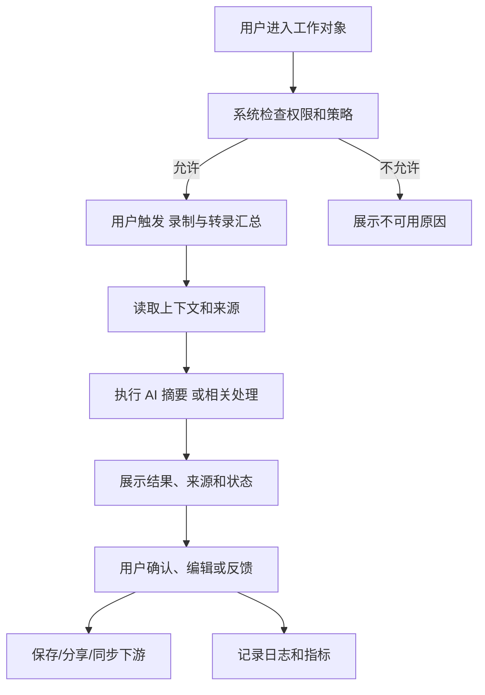

# 输出样例：Complete PRD｜Microsoft Teams Intelligent Recap：会议智能回顾

> 说明：本案例基于公开产品页面、帮助中心或官方文档整理，围绕真实线上功能改写为完整 PRD/需求案例。内容为原创分析与结构化表达，不是对官方文档的复制。

## 1. 参考来源

- https://support.microsoft.com/office/meeting-recap-in-microsoft-teams-c2e3a0fe-504f-4b2c-bf85-504938f110ef

## 2. 真实功能背景

### 2.1 功能概述

Teams Recap 在会议结束后汇总录制、转录、共享文件、议程、AI 摘要和后续任务，帮助用户快速追踪会议结果。

本案例不是虚构产品，而是基于上述公开资料中的真实能力进行 BA 化拆解。PRD 重点关注：用户为什么需要该能力、企业如何控制风险、研发如何理解边界、上线后如何判断价值。

### 2.2 目标用户

会议参与者、项目经理、管理者、缺席人员

### 2.3 公开功能能力拆解

| 能力 | 用户价值 | 需求表达 | 首版验收重点 |
|---|---|---|---|
| 录制与转录汇总 | 降低用户完成相关任务的操作成本 | 系统应支持“录制与转录汇总”相关核心流程，并在结果中展示状态、来源或可编辑内容 | 用户能在真实业务对象中完成端到端操作，且失败时有明确提示 |
| AI 摘要 | 降低用户完成相关任务的操作成本 | 系统应支持“AI 摘要”相关核心流程，并在结果中展示状态、来源或可编辑内容 | 用户能在真实业务对象中完成端到端操作，且失败时有明确提示 |
| 共享文件聚合 | 降低用户完成相关任务的操作成本 | 系统应支持“共享文件聚合”相关核心流程，并在结果中展示状态、来源或可编辑内容 | 用户能在真实业务对象中完成端到端操作，且失败时有明确提示 |
| 后续任务提取 | 降低用户完成相关任务的操作成本 | 系统应支持“后续任务提取”相关核心流程，并在结果中展示状态、来源或可编辑内容 | 用户能在真实业务对象中完成端到端操作，且失败时有明确提示 |

## 3. 问题定义

### 3.1 用户问题

用户在处理“Microsoft Teams Intelligent Recap：会议智能回顾”相关任务时，通常需要同时理解上下文、查找材料、判断下一步动作并与团队同步。如果没有产品化能力，用户会依赖手动复制、会议口头同步、个人经验或外部工具，容易造成信息遗漏、过程不可追踪和结果质量不稳定。

### 3.2 业务问题

对企业客户来说，录制与转录汇总、AI 摘要、共享文件聚合、后续任务提取 这类能力如果缺少权限、审计和配置机制，会带来数据泄露、误操作、标准不统一和成本不可控的问题。因此该功能不能只做成单点按钮，需要成为可治理、可衡量、可复盘的业务能力。

### 3.3 机会点

- 把高频重复操作嵌入现有工作流。
- 把隐性经验转成可配置规则、来源引用和可追踪结果。
- 通过结构化输出减少跨团队沟通成本。
- 用真实使用指标判断功能是否产生业务价值。

## 4. 范围定义

### 4.1 MVP 范围

- 支持 录制与转录汇总。
- 支持 AI 摘要。
- 支持基础权限校验和错误提示。
- 支持结果确认、编辑、复制和反馈。
- 支持管理员查看基础使用数据。

### 4.2 第二阶段范围

- 扩展到 共享文件聚合。
- 扩展到 后续任务提取。
- 增加团队级配置、审计报表和更细粒度的策略控制。
- 与下游协作系统或任务系统集成。

### 4.3 不做范围

- 不绕过原系统权限。
- 不自动执行高风险动作，除非管理员显式配置且用户确认。
- 不承诺输出 100% 正确。
- 不支持没有来源、没有上下文或未授权数据的推断。

## 5. 干系人分析

| 角色 | 核心诉求 | 关注风险 | 参与阶段 |
|---|---|---|---|
| 终端用户 | 快速完成 录制与转录汇总 和 AI 摘要 | 结果错误、入口难找、编辑困难 | 访谈、灰度、UAT |
| 业务负责人 | 证明功能能提升效率或质量 | 指标不清晰、团队不采纳 | 目标定义、上线复盘 |
| 产品/BA | 将真实功能转成可开发、可验收需求 | 场景遗漏、范围失控 | 全流程 |
| 研发/架构 | 明确系统边界、接口、性能和异常 | 集成复杂、历史系统不兼容 | 技术方案、开发联调 |
| 运营/支持 | 能培训用户并处理问题 | 用户误用、问题无法定位 | 发布准备、上线运营 |
| 安全/合规/IT | 权限、审计、数据保留和开关 | 敏感数据泄露、日志不足 | 安全评审、上线审批 |

## 6. 用户旅程

### 6.1 首次使用

1. 用户进入当前工作对象。
2. 系统判断该用户是否具备使用 录制与转录汇总 的权限。
3. 用户点击入口并查看数据使用提示。
4. 系统读取当前上下文并生成结果。
5. 用户确认、编辑、复制、保存或反馈。

### 6.2 团队协作

1. 用户将结果共享给相关成员。
2. 成员查看结果来源、更新时间和状态。
3. 如需继续处理，可将结果转成任务、评论、文档或下游记录。
4. 系统保留修改历史和操作人。

### 6.3 管理治理

1. 管理员配置哪些团队可使用该能力。
2. 管理员配置默认开关、数据范围、日志保留和外部分享策略。
3. 管理员查看使用量、错误率、反馈和成本趋势。

## 7. 用户故事

| ID | 用户故事 | 验收标准 |
|---|---|---|
| US-01 | 作为终端用户，我希望直接在当前工作流中使用 录制与转录汇总。 | 入口清晰，用户无需离开主对象即可完成操作。 |
| US-02 | 作为终端用户，我希望系统支持 AI 摘要。 | 输出结果结构清楚，并能被复制、保存或分享。 |
| US-03 | 作为团队负责人，我希望结果能说明来源和生成依据。 | 结果展示来源、时间、触发条件或关联对象。 |
| US-04 | 作为管理员，我希望控制 共享文件聚合 的可用范围。 | 管理页支持按团队、角色或空间配置。 |
| US-05 | 作为支持人员，我希望定位 后续任务提取 相关失败原因。 | 日志记录错误码、输入对象、处理状态和反馈。 |

## 8. 专属功能需求

| ID | 专属功能需求 | 触发条件 | 输出/状态 | 优先级 |
|---|---|---|---|---|
| SFR-01 | 支持 录制与转录汇总 | 用户在对应工作对象中主动触发，或系统根据规则提示 | 生成可确认的结果，并保留来源、时间和处理状态 | P0 |
| SFR-02 | 支持 AI 摘要 | 用户在对应工作对象中主动触发，或系统根据规则提示 | 生成可确认的结果，并保留来源、时间和处理状态 | P0 |
| SFR-03 | 支持 共享文件聚合 | 用户在对应工作对象中主动触发，或系统根据规则提示 | 生成可确认的结果，并保留来源、时间和处理状态 | P0 |
| SFR-04 | 支持 后续任务提取 | 用户在对应工作对象中主动触发，或系统根据规则提示 | 生成可确认的结果，并保留来源、时间和处理状态 | P0 |
| SFR-99 | 反馈与纠错 | 用户认为结果错误、无关或不完整 | 记录反馈类型、原始上下文和用户修正内容 | P1 |

## 9. 通用功能需求

| ID | 功能需求 | 说明 | 优先级 |
|---|---|---|---|
| FR-01 | 功能入口 | 在真实工作流主界面展示入口，并说明输出结果。 | P0 |
| FR-02 | 权限校验 | 继承原系统权限，不向无权限用户展示来源内容。 | P0 |
| FR-03 | 上下文读取 | 读取当前对象、历史记录、相关文件或连接器数据。 | P0 |
| FR-04 | 结果展示 | 展示摘要、详细结果、来源、状态和下一步动作。 | P0 |
| FR-05 | 人工编辑 | 用户可编辑、重新生成、接受或放弃结果。 | P0 |
| FR-06 | 反馈闭环 | 用户可标记错误、无关、不完整或有帮助。 | P1 |
| FR-07 | 管理配置 | 管理员可配置开关、范围、日志和数据策略。 | P1 |
| FR-08 | 指标看板 | 展示使用量、采纳率、错误率、负反馈率。 | P2 |

## 10. 数据与权限

| 数据类型 | 用途 | 权限要求 | 风险控制 |
|---|---|---|---|
| 当前对象内容 | 作为 录制与转录汇总 的核心输入 | 继承对象权限 | 不展示无权限内容 |
| 用户身份与角色 | 判断功能可用性和可见范围 | 组织账号体系 | 记录操作人 |
| 历史操作记录 | 支持审计和质量分析 | 管理员/审计角色 | 保留日志和变更记录 |
| 外部连接器数据 | 支持 共享文件聚合 或 后续任务提取 | 需授权 | 显示连接状态和失败原因 |
| 用户反馈 | 优化功能质量 | 脱敏统计 | 不直接暴露个人敏感信息 |

## 11. 非功能需求

- 性能：普通任务 15 秒内返回初步结果，长任务展示进度和取消入口。
- 可用性：外部服务不可用时，主业务对象仍可正常访问。
- 安全：严格遵守原系统权限、租户隔离和管理员开关。
- 可观测性：记录请求、处理状态、错误码、耗时和用户反馈。
- 可解释性：关键结果必须展示来源、依据或触发条件。
- 可访问性：结果区域和主要操作支持键盘导航与文本提示。

## 12. 验收标准

- AC-01：给定用户拥有相关权限且输入资料完整，当用户触发“录制与转录汇总”时，系统应在合理时间内返回结构化结果，并允许用户确认、编辑或放弃。
- AC-02：给定用户拥有相关权限且输入资料完整，当用户触发“AI 摘要”时，系统应在合理时间内返回结构化结果，并允许用户确认、编辑或放弃。
- AC-03：给定用户拥有相关权限且输入资料完整，当用户触发“共享文件聚合”时，系统应在合理时间内返回结构化结果，并允许用户确认、编辑或放弃。
- AC-04：给定用户拥有相关权限且输入资料完整，当用户触发“后续任务提取”时，系统应在合理时间内返回结构化结果，并允许用户确认、编辑或放弃。
- AC-99：给定用户权限不足或数据缺失，当用户触发功能时，系统必须展示具体原因，不能生成无依据的确定性结果。

## 13. 指标设计

| 指标 | 定义 | 目标 |
|---|---|---|
| 激活率 | 有权限用户中至少使用一次功能的比例 | 首月 30% |
| 采纳率 | 结果被保存、发送、复制、执行或转成任务的比例 | 60% 以上 |
| 人工大改率 | 用户对结果进行大幅重写的比例 | 低于 35% |
| 失败率 | 触发后未得到可用结果的比例 | 低于 5% |
| 负反馈率 | 用户标记错误、无用或风险的比例 | 低于 5% |
| 管理配置完成率 | 试点客户完成权限和策略配置的比例 | 90% |

## 14. 业务流程

## 15. 风险与应对

| 风险 | 影响 | 应对 |
|---|---|---|
| 结果不准确 | 用户误采纳错误内容 | 展示来源、置信提示和人工确认入口 |
| 权限泄露 | 企业客户无法上线 | 严格继承权限，增加审计日志 |
| 用户不信任 | 使用率低 | 提供解释、编辑和反馈机制 |
| 场景过宽 | MVP 延期 | 首版只做 录制与转录汇总 和 AI 摘要 |
| 成本不可控 | 企业部署受阻 | 增加用量限制、缓存和管理员报表 |

## 16. 发布计划

### Alpha

- 面向内部团队或 1 个试点客户开放。
- 验证 录制与转录汇总、AI 摘要、权限和日志。
- 收集真实失败案例。

### Beta

- 扩展到更多团队。
- 加入 共享文件聚合、管理员配置和指标看板。
- 完善培训材料和支持流程。

### GA

- 完成安全评审、性能压测和客户成功交接。
- 建立季度指标复盘机制。
- 根据反馈规划 后续任务提取 的增强版本。

## 17. BA 复盘要点

- 该案例的真实功能核心是：录制与转录汇总、AI 摘要、共享文件聚合、后续任务提取。
- BA 不能只记录功能名称，需要拆出用户任务、权限边界、输入输出和验收条件。
- AI 或自动化能力必须包含人工确认、错误反馈、来源解释和管理员治理。
- 如果要把它用于 BA-Agent 训练，应让 Agent 学会从公开功能资料反推出完整需求结构。

## 18. 待澄清问题

- 首版优先做 录制与转录汇总 还是 AI 摘要？
- 共享文件聚合 是否需要管理员单独授权？
- 后续任务提取 的失败状态如何展示给用户？
- 哪些结果可以自动同步到下游，哪些必须人工确认？
- 上线后由谁负责指标复盘和质量改进？
